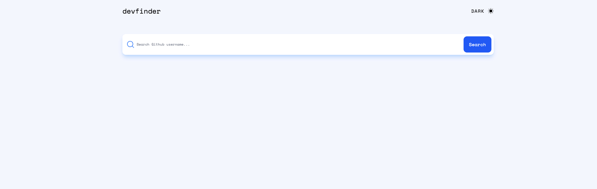
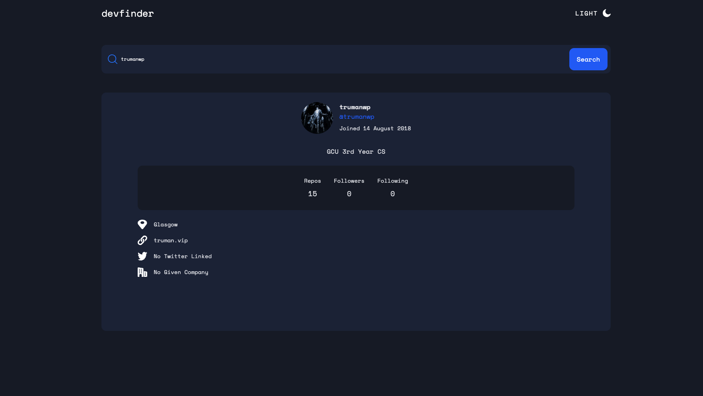

https://github-user-search-orcin.vercel.app/ 

# DevFinder

A React application that allows users to search for GitHub profiles and view detailed information using the GitHub API. Supports dark mode and responsive design.

---

## Features

- Search for GitHub users by username.
- Display user profile information: avatar, bio, location, company, website, and Twitter.
- Show GitHub stats: public repositories, followers, and following.
- Dark/light mode toggle.
- Responsive design for desktop and mobile.
- Graceful handling of loading states and errors (user not found).  

---

## Tech Stack

- React
- Tailwind CSS
- React Query (`@tanstack/react-query`) for API data fetching
- GitHub REST API

---

## Usage

- Enter a GitHub username in the search bar.

- Click the Search button.

- The user’s profile and stats will be displayed.

- Click the Light/Dark mode toggle to switch themes.

- Optionally, click Home to reset the search and start over.

---

## Screenshots

# Light Mode Start Screen

# Dark Mode Search

